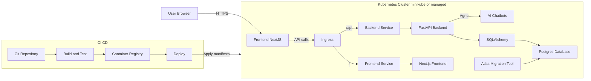

# Junior Full-Stack Developer - 2-Day Technical Assessment - Hassan Abouelela

# AI Usage

A note on AI usage:

This project made heavy use of AI to generate and modify code, however I reviewed all the code,
and made architectural decisions that the AI could not.
I tested and debugged, and ensured the product meets high standards.
AI was used as a tool to accelerate development, rather than create the entire project.

# TODO

- [ ] ShadCDN not used
- [ ] Dependency scanning

# Future Expansions

- [ ] Flesh out the backend test suite, and add frontend testsing
- [ ] Use terraform to manage the deployment of the production hosts
- [ ] Migrate from minikube to a more mature offering
