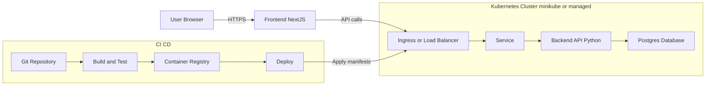

# Junior Full-Stack Developer - 2-Day Technical Assessment - Hassan Abouelela

# TODO

- [ ] ShadCDN not used
- [ ] Dependency scanning

# Future Expansions

- [ ] Flesh out the backend test suite, and add frontend testsing
- [ ] Use terraform to manage the deployment of the production hosts
- [ ] Migrate from minikube to a more mature offering
